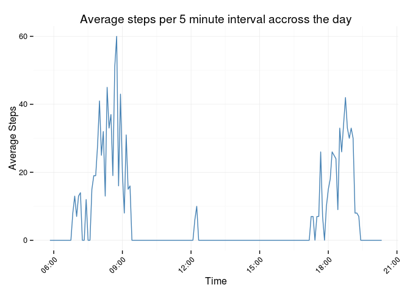
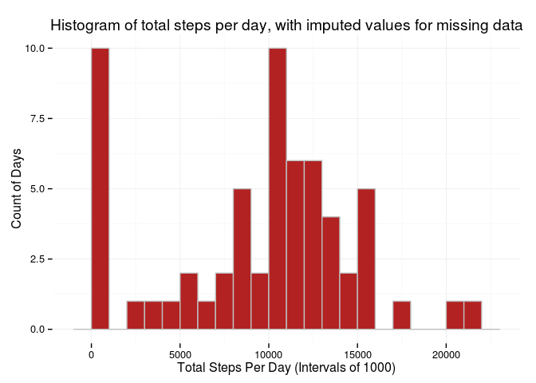
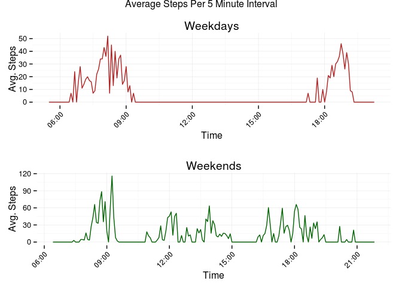

# Stepping Through Time
### An analysis of personal movement data
##### Jim Leach
*******************************************************************************

### Introduction and Background
This report has been created as part of the *Reproducible Research* MOOC offered by Johns Hopkins university on the Coursera website [here](https://class.coursera.org/repdata-004). 

Briefly, the goal of this assignment was to take two month's worth of pedometer data for an anonymous individual and perform some brief summary and exploratory analysis on it in R. A full summary of the assigmnet can be found on the associated [GitHub repository](https://github.com/Jim89/RepData_PeerAssessment1). 

The anaysis is broken down in to a number of steps, which are set out below:

1. Load the data;
2. Process the data;
3. Calculate and chart daily average steps;
4. Calculate and chart the average steps in 5 minute intervals throughout the day;
5. Impute missing values in the data set and create a new, clean data set and repeat step 3 for the cleaned data; and
6. Analyse differences in activity between weekdays and weekends.

The following sections set out the approach taken to perform each of these steps.

*******************************************************************************
### Analysis Methodology

##### Step 0 - Preparing the R working environment - Packages

A number of packages have been used and are, therefore, required for this analysis. To make the code more reproducible, conditional installation and subsequent loading of these packages is performed as part of the working script. This is achieved using the following code:

    if(require("package name here",quietly=T)){
      print("loading "package name here"")
    } else {
      print("trying to install "package name here"")
      install.packages(""package name here"")
      library("package name here",quietly=T)
      print(""package name here" installed and loaded")
      if(require("package name here",quietly=T)){
        } else {
        stop("could not install "package name here"")
      }
    }
    
The packages used by this analysis are:

* [lubridate](http://www.r-statistics.com/2012/03/do-more-with-dates-and-times-in-r-with-lubridate-1-1-0/)
* [dplyr]((http://blog.rstudio.org/2014/01/17/introducing-dplyr/))
* [ggplot2](http://ggplot2.org/)
* [sqldf](http://www.r-bloggers.com/manipulating-data-frames-using-sqldf-a-brief-overview/)
* [gridExtra](http://www.r-bloggers.com/extra-extra-get-your-gridextra/)
* [scales](http://cran.r-project.org/web/packages/scales/index.html)

For more information about any of these packages please see the documentation using `help(package="package name here")`.
        
For brevity, the conditional installation and loading of each package has been masked from this document.


##### Step 1 - Getting and loading the data

The data for this analysis are stored on the [course website](https://d396qusza40orc.cloudfront.net/repdata%2Fdata%2Factivity.zip). The analysis has automated the download and loading of the data in to R. This is done using:

```r
# 1a. Set the URL for the data
url<-"https://d396qusza40orc.cloudfront.net/repdata%2Fdata%2Factivity.zip"

# 1b. Conditionally create a directory in the working directory to store the data 
if(!file.exists("./data")){dir.create("./data",showWarnings = FALSE)}

# 1c. Download and unzip the data - download method conditional on operating system
if(Sys.info()["sysname"]=="Windows"){setInternet2(use = TRUE)}
ifelse(Sys.info()["sysname"]=="Windows",
       download.file(url=url,"./data/data.zip",quiet=TRUE),
       download.file(url=url,"./data/data.zip",method="curl",quiet=TRUE)
       )
unzip("./data/data.zip",overwrite=TRUE,exdir="./data")

# 1d. Read in the data
data<-read.csv("./data/activity.csv",
               header=T,
               stringsAsFactors=F,
               colClasses=c("numeric",rep("character",2)))
```

##### Step 2 - Process the data

The data read in to R are processed and cleaned slightly to facilitate processing.


```r
# 2a. Using the lubridate package, format the date as such
data$date<-ymd(data$date)
# 2b. Create a new variable that lists the day of the week
data$day<-wday(data$date,label=T,abbr=F)
# 2c. Create a factor variable for weekday/weekend categorisation
data$week<-factor(x=ifelse(data$day %in% c("Saturday","Sunday")
                           ,"Weekend"
                           ,"Weekday")
                  ,levels=c("Weekend","Weekday")
                  )
# 2d. Create a new field, "time" that transforms the "interval" field in to the appropriate time
data$time<-ifelse(nchar(data$interval)==1,
                  paste("00:00:0",data$interval,sep=""),
                  ifelse(nchar(data$interval)==2,
                         paste("00:00:",data$interval,sep=""),
                  ifelse(nchar(data$interval)==3,
                         paste("0",substr(data$interval,1,1),":",substr(data$interval,2,3),":00",sep=""),
                  ifelse(nchar(data$interval)==4,
                         paste(substr(data$interval,1,2),":",substr(data$interval,3,4),":00",sep=""),
                         paste("")))))
```

##### Step 3 - Summarising and reporting activity by day

After loading and processing the data, the next step in the analysis is a summary of the data by day.

The first step is to perform this summarisation of the data. This is done using the fantastic dplyr package:


```r
# 3a. Using the dplyr package, summarise by day, calculating total steps
day_summary<-data %.%
             select(-time) %.%
             group_by(date) %.%
             summarise(total_steps=sum(na.omit(steps)))
```

Next, a chart of the total steps taken per day is created.

```r
# 3b. Make the histogram
(ggplot(day_summary,aes(x=na.omit(total_steps)))
+geom_histogram(binwidth=1000,fill="steelblue",color="grey")
+theme_minimal()
+xlab("Total Steps Per Day (Intervals of 1000)")
+ylab("Count of Days")
+ggtitle("Histogram of Total Steps Taken Per Day"))
```

 

It is clear that the majority of days show total steps of between approximately 7,50 and 15,000 steps - an impressive count given that 10,000 is often set as a challenging total!

It's also interesting to note the number of days with a very low count (0 to 1000) of steps - it would be interesting to know if this is due to measurement error, or just a few lazy days.

Finally in this section, the median and mean total steps per day is calculated:

```r
# 3c. Calculate the median and mean total steps per day
options(scipen=100)
median_steps<-round(median(day_summary[,2]))
mean_steps<-round(mean(day_summary[,2]))
```

The median number of steps per day is 10395. Similarly, the mean number of steps taken per day is 9354.


##### Step 4 - Summarising and reporting activity by interval

Next, the data is summarised intra-day by 5 minute time interval. This provides a good overview of where in a day the recorded steps are occurring.

Again, the first step is to perform summarisation, this time on the time interval, but again using the ever-fantastic dplyr.The time interval is then converted to a time field, using the lubridate package.

```r
# 4a. Summarise the data by interval
interval_summary<-data.frame(
                  data %.%
                  group_by(time) %.%
                  summarise(average_steps=median(na.omit(steps))))
# 4b. Format time as time
interval_summary$time<-parse_date_time(interval_summary$time,orders="H:M:S")
```

As part of the working for this analysis, it was found that there were significant portions of time (overnight) where no steps were recorded. As such, to facilite a better looking graph, these records were ignored. This was achieved by finding the first and last time steps were recorded:

```r
# 4c. Create a row number than can be used as an index
interval_summary$row<-seq(1:nrow(interval_summary))
# 4d. Find the first time steps were recorded
first_data<-min(filter(interval_summary,average_steps!=0)$row)
# 4e. Find the last time steps were recorded
last_data<-max(filter(interval_summary,average_steps!=0)$row)
# 4f. Clean up the row number
interval_summary<-select(interval_summary,-row)
```

Once this was achieved, a chart of median steps over time was created:

```r
# plot line graph of average steps per interval
ggplot(interval_summary[(first_data-12):(last_data+12),], # +/- 1 hour each end
       aes(x=time,y=average_steps,group=1))+
  geom_line(color="steelblue")+
  xlab("Time")+
  ylab("Average Steps")+
  ggtitle("Average steps per 5 minute interval accross the day")+
  theme_minimal()+
  theme(axis.text.x = element_text(angle = 45, hjust = 1))
```

 

It appears that (as one might expect) there a two peaks of activity, one in the morning (on the way to work, perhaps) and one in the evening (returning home) with a small spike of activity right around lunch time. 

Subsequently, it is possible to find the five minute interval that contains, on average, the most steps of any interval accross the day:

```r
max_interval<-filter(interval_summary,average_steps==max(average_steps))
interval<-substring(as.character(max_interval[,1]),11)
steps<-max_interval[,2]
rm(max_interval)
```

The most number of steps is recorded in the five minute interval ending at :45:00, where it appears that, on average, the participant takes 60 steps.


##### Step 5 - Imputing missing values

When reading in data, it is often sensible to get an idea of the number of missing value in the variable(s) of interest. In this data, it is the steps per interval that is of interest.

The total number of missing values, and the proportion of the total that this represents are calculated:

```r
# 5a. Calculate number and proportion of missing values
missing_values<-sum(is.na(data$steps))
total_rows<-nrow(data)
prop<-missing_values/total_rows
prop<-percent(prop)
```

The total number of missing values in the steps data is 2304. This represents 13.1% of the data. 

In order to impute missing values, a granular approach was taken such that the median value for a given five minute interval was used to replace missing values in the data. 

This was done using the sqldf package, specifically the *coalesce* function in the SQL language. Coalesce takes the first non-NULL (or in R terms, the first non-NA) value in a vector of values and so is perfect for filling in missing data with something else.

As such, the median steps for a given 5 minute interval (calculated earlier in step 4) was joined to the original data, and the coalese function used to impute the missing values. All values from the original data are maintianed (including the weekend/weekday factor) and a new field containing the imputed values is added.


```r
# 5b. Recreate interval summary but leave time as character for the join:
interval_summary2<-data.frame(
                  data %.%
                  group_by(time) %.%
                  summarise(average_steps=median(na.omit(steps))))
# 5c. Perform the join
data2<-sqldf("SELECT
                 data.*
                ,coalesce(data.steps,med.average_steps) as clean_steps
              FROM
                data as data
              LEFT JOIN
                interval_summary2 as med
              ON
                data.time = med.time"
             )
```

```
## Loading required package: tcltk
```

```r
# 5d. Clean up the interval summary as it's no longer needed
rm(interval_summary2)
```


To get the values for the median and mean steps using the imputed data set, the same day-wise summary was performed (again, using dplyr):

```r
# 5e. Perform summarisation by day
day_summary_clean<- data2 %.%
                    select(-time) %.%
                    group_by(date) %.%
                    summarise(total_steps=sum(na.omit(steps)))
```

The median and mean values for daily steps were recalculated:

```r
# 5f. Calculate the new values
options(scipen=100)
median_steps_clean<-round(median(day_summary_clean[,2]))
mean_steps_clean<-round(mean(day_summary_clean[,2]))
# 5g. Assess the differences
med_diff<-diff(c(median_steps,median_steps_clean))
mean_diff<-diff(c(mean_steps,mean_steps_clean))
med_diff_text<-if(med_diff>0){"greater"}else if(med_diff<0){"less"}else{"different"}
mean_diff_text<-if(mean_diff>0){"greater"}else if(mean_diff<0){"less"}else{"different"}
```

Using the imputed data set, it is the case that the median steps per interval is 10395. This is 0 steps different  from the value using missing data.

Using the imputed data set, it is the case that the mean steps per interval is 9354. This is 0 steps different  from the value using missing data.

A histogram of the daily activity using the imputed data was plotted. Unsurprisingly, it is no different from the previously created histogram (save for color used here for purely artistic purposes):

```r
# 5h. Create histogram of daily activity with imputed values
ggplot(day_summary_clean,aes(x=na.omit(total_steps)))+
 geom_histogram(binwidth=1000,fill="firebrick",color="grey")+
 theme_minimal()+
 xlab("Total Steps Per Day (Intervals of 1000)")+
 ylab("Count of Days")+
 ggtitle("Histogram of total steps per day, with imputed values for missing data")
```

 

##### Step 6 - Analysing differences in weekdays and weekends

The final step of this analysis was to plot the average steps per 5 minute interval across the day, split by weekends and weekdays. 

The weekend/weekday factor has already been created (see step 2) and is present in the imputed data set that is used for this step. 

The first step in this exercise was therefore to create the summary by interval, including the weekday/weekend factor into the grouping.


```r
# 6a. Summary that can be split by weekend
interval_summary_weeks<- data.frame(
                        data2 %.%
                        group_by(week, time) %.%
                        summarise(average_steps=median(na.omit(steps))))
```

Two new data sets were then created, the first containing step data for weekends only, which was then plotted and the plot saved to a variable.

```r
# 6b. Subset to weekend data
weekend<-interval_summary_weeks %.% filter (week=="Weekend")
# Format time as time
weekend$time<-parse_date_time(weekend$time,orders="H:M:S")
# Find the first and last rows (i.e. times) that steps are recorded
weekend$row<-seq(1:nrow(weekend))
first_data_weekend<-min(filter(weekend,average_steps!=0)$row)
last_data_weekend<-max(filter(weekend,average_steps!=0)$row)
weekend<-select(weekend,-row)

# 6c. Construct the plot for weekend data
weekend_plot<-
ggplot(weekend[(first_data_weekend-12):(last_data_weekend+12),],
       aes(x=time,y=average_steps,group=1))+
  geom_line(color="darkgreen")+
  xlab("Time")+
  ylab("Avg. Steps")+
  ggtitle("Weekends")+
  theme_minimal()+
  theme(axis.text.x = element_text(angle = 45, hjust = 1))
```

The second data set contained step datat for weekends only. A similar plot was also made and the plot saved to a variable:

```r
# 6d. Subset to week data
week<-interval_summary_weeks %.% filter (week=="Weekday")
# Format time as time
week$time<-parse_date_time(week$time,orders="H:M:S")
# Find the first and last rows (i.e. times) that steps are recorded
week$row<-seq(1:nrow(week))
first_data_week<-min(filter(week,average_steps!=0)$row)
last_data_week<-max(filter(week,average_steps!=0)$row)
week<-select(week,-row)

# 6e. Construct the plot for the week data
week_plot<-
  ggplot(week[(first_data_week-12):(last_data_week+12),], 
         aes(x=time,y=average_steps,group=1))+
  geom_line(color="firebrick")+
  xlab("Time")+
  ylab("Avg. Steps")+
  ggtitle("Weekdays")+
  theme_minimal()+
  theme(axis.text.x = element_text(angle = 45, hjust = 1))
```

Finally, these two plots were brought togeher using the gridExtra package to create the final plot to assess differences in weekend and weekday activity:

```r
grid.arrange(week_plot,
             weekend_plot,
             ncol=1,
             nrow=2,
             main="Average Steps Per 5 Minute Interval")
```

 

It is interesting to note the differences in activity between the weekends and weekdays. Overall, it appears that weekends have more activity, and that that activity is more distribted througout the day. 
